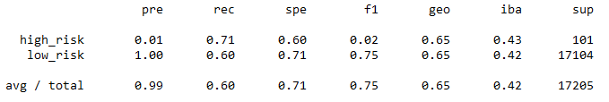
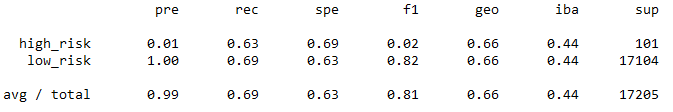
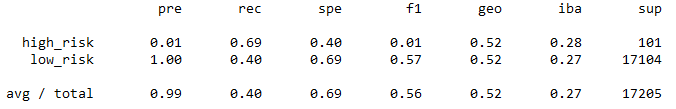
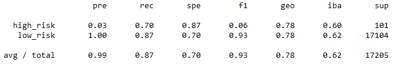
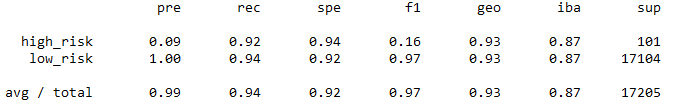

# Credit Risk Analysis with Supervised ML and Sampling Techniques

## Overview - Purpose

LendingClub is a peer to peer lending services company that has a dataset which tells us how likely someone is to be a credit risk. Because credit risk is an inherently unbalanced classification problem with good loans greatly outnumbering risky loans, we need to use techniques to address this problem. In this analysis we will try to oversample the data using Random Over Sampler and SMOTE algorithms. We will also try undersampling the data using the Cluster Centroids algorithm. Then we will use a combinatorial approach of over and undersampling using the SMOTEENN algorithm. Finally, we will compare the results of the Balanced Random Forest Classifier and Easy Ensemble Classifier to predict credit risk. All of these methods will be evaluated for their balanced accuracy, confusion matrix, and an imbalanced classification report that tells us precision and recall. 

## Results

Random Over Sampler
  - Bal Acc: 0.657
  - Prec: high_risk 0.01, low_risk 1.00
  - Rec: high_risk 0.71, low_risk 0.60
  
  
 
SMOTE Oversampling
  - Bal Acc: 0.662
  - Prec: high_risk 0.01, low_risk 1.00
  - Rec: high_risk 0.63, low_risk 0.69
  
  

Cluster Centroids Undersampling
  - Bal Acc: 0.544
  - Prec: high_risk 0.01, low_risk 1.00
  - Rec: high_risk 0.69, low_risk 0.40
  
  
 
SMOTEENN Over Under Sampling
  - Bal Acc: 0.645
  - Prec: high_risk 0.01, low_risk 1.00
  - Rec: high_risk 0.72, low_risk 0.57
  
  
 
Balanced Random Forest Classifier
  - Bal Acc: 0.789
  - Prec: high_risk 0.03, low_risk 1.00
  - Rec: high_risk 0.70, low_risk 0.87
  
  
 
Easy Ensemble Classifier
  - Bal Acc: 0.932
  - Prec: high_risk 0.09, low_risk 1.00
  - Rec: high_risk 0.92, low_risk 0.94
  
  

## Summary

