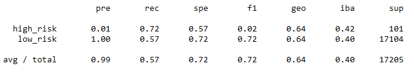

# Credit Risk Analysis with Supervised ML and Sampling Techniques

## Overview - Purpose

LendingClub is a peer to peer lending services company that has a dataset which tells us how likely someone is to be a credit risk. Because credit risk is an inherently unbalanced classification problem with good loans greatly outnumbering risky loans, we need to use techniques to address this problem. In this analysis we will try to oversample the data using Random Over Sampler and SMOTE algorithms. We will also try undersampling the data using the Cluster Centroids algorithm. Then we will use a combinatorial approach of over and undersampling using the SMOTEENN algorithm. Finally, we will compare the results of the Balanced Random Forest Classifier and Easy Ensemble Classifier to predict credit risk. All of these methods will be evaluated for their balanced accuracy and an imbalanced classification report that tells their precision and recall. 

## Results

### Random Over Sampler
  - Balanced Accuracy: 0.657
  - Precision: high_risk 0.01, low_risk 1.00
  - Recall: high_risk 0.71, low_risk 0.60
  
  
 
### SMOTE Oversampling
  - Balanced Accuracy: 0.662
  - Precision: high_risk 0.01, low_risk 1.00
  - Recall: high_risk 0.63, low_risk 0.69
  
  

### Cluster Centroids Undersampling
  - Balanced Accuracy: 0.544
  - Precision: high_risk 0.01, low_risk 1.00
  - Recall: high_risk 0.69, low_risk 0.40
  
  
 
### SMOTEENN Over Under Sampling
  - Balanced Accuracy: 0.645
  - Precision: high_risk 0.01, low_risk 1.00
  - Recall: high_risk 0.72, low_risk 0.57
  
  
 
### Balanced Random Forest Classifier
  - Balanced Accuracy: 0.789
  - Precision: high_risk 0.03, low_risk 1.00
  - Recall: high_risk 0.70, low_risk 0.87
  
  
 
### Easy Ensemble Classifier
  - Balanced Accuracy: 0.932
  - Precision: high_risk 0.09, low_risk 1.00
  - Recall: high_risk 0.92, low_risk 0.94
  
  

## Summary

The Easy Ensemble Classifier had by far the greatest balanced accuracy (0.932), followed by the Balanced Random Forest Classifier (0.789), SMOTE (0.662), Random Over Sampler (0.657), SMOTEENN (0.645), and last Cluster Centroids (0.544). All models had perfect precision on the low risk loans, with Easy Ensemble Classifier having the highest on high risk loans at 0.09. The Easy Ensemble Classifier also had the highest recall on both high risk (0.92) and low risk (0.94) loans. If we had to choose one model the obvious choice would be the Easy Ensemble Classifier based on it performing by far the best. That being said, a 0.09 precision on high risk loans means that we are making 10 times more false positives than true positives. That's a lot of people whose loans we would reject as high risk incorrectly. Because of the harm that would cause, I would not recommend any of our models. Instead I would recommend we either collect more data, process the data more effectively, or choose a different model.
